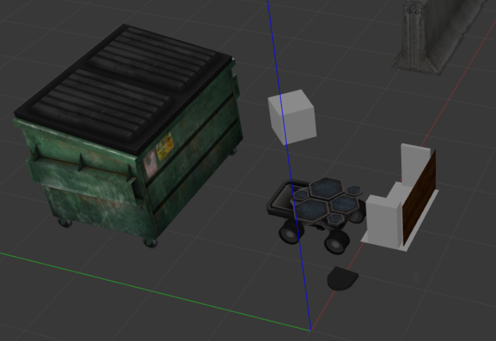

# “Warm Up” Project: Finite State Machines, Wall Following, Obstacle Avoidance  

**Joseph Liu and David Barsoum**  
Computational Robotics, Fall 2025  

---

## 1. Overview  
This warm-up project introduced us to ROS2 and the Neato robots through a series of behavior implementations. We developed six key behaviors: teleoperation, square-path driving, wall following, person tracking, and obstacle avoidance. In addition to these six behaviors, we also developed a finite-state machine that ties obstacle avoidance, wall following, teleoperation, and emergency stop functionality together.  

---

# 2 Teleoperation  

  

## 2.1 Overview  

The goal of the “Teleop” behavior is to enable manual control of a Neato’s linear and angular velocity using a standard keyboard interface. Being able to manually control a robot is especially valuable for tasks such as initial testing, manual repositioning, or overriding autonomous behaviors in uncertain environments. Teleop serves as both a debugging tool and a fallback mode, ensuring that the robot can still be safely navigated even if higher-level behaviors fail or produce unexpected results.  

## 2.2 Methodology  

The following keybinds, shown in the table below, were chosen based on the common “WASD” control scheme commonly used for movement in videogames. Using such a control scheme allows for intuitive direction control that many users would already be used to.  

| Key    | Linear Velocity | Angular Velocity |
|--------|----------------|------------------|
| w      | +0.1 m/s       | +0.0 rad/s       |
| s      | -0.1 m/s       | +0.0 rad/s       |
| a      | +0.0 m/s       | +0.5 rad/s       |
| d      | +0.0 m/s       | -0.5 rad/s       |
| e      | +0.0 m/s       | 0.0 rad/s        |
| q      | 0.0 m/s        | +0.0 rad/s       |
| space  | 0.0 m/s        | 0.0 rad/s        |
| !      | exit node      | exit node        |  

We decided that “WASD” keystroke should increment either linear or angular velocity by a fixed step, as based on experience, it allowed more precise velocity control while driving the Neato compared to having either fixed or preset velocities from a keystroke. To further build upon precise control, pressing either “q” or “e” would set either linear or angular velocity to 0 respectively, and the spacebar would eliminate all velocity. Velocity commands were published over the “/cmd_vel” topic as Twist() messages, which contain information about linear and angular velocity. Finally, “!” would be used to stop manual control by eliminating all velocity and exiting the node. The exit command being a combination keystroke significantly reduces the chance of the user triggering an accidental node exit.  

An important consideration was to make sure that keystroke inputs were non-blocking so it would not halt the rest of the ROS node. This was addressed using Python’s tty and termios modules to set the terminal into raw mode, allowing single keypresses to be read immediately without waiting for Enter. termios was also used to restore the terminal to its original settings afterward. To avoid blocking the main execution thread, the key reading loop was run in a separate thread, ensuring that velocity commands and ROS communication could continue in parallel with real-time user input.  

## 2.3 Limitations/Future Improvements  

Future improvements to consider would be to add safety features, such as a required periodic input that lets the software know the user is still in control. If no periodic input is detected, an emergency stop would be triggered. Additionally, implementing a UI that could display current speed, key mappings, and active commands would also enhance usability and drive efficiency.  

---

# 3 Square Drive  

  

## 3.1 Overview  

The goal of the “Square Drive” behavior is to autonomously command a Neato robot to navigate in a square trajectory using odometry-based feedback control for robustness. This behavior serves as a basic demonstration of the Neato’s ability to perform waypoint-based navigation, combining position estimation with feedback control to execute both rotations and straight-line motions with precision.  

## 3.2 Methodology  

Driving in a square pattern was achieved by defining a set of four waypoints forming the corners of a square 1 meter apart from each other, and commanding the robot to sequentially rotate and drive to each waypoint. The motion between waypoints was handled using proportional control for both linear and angular velocities, ensuring smooth transitions and precise stopping. Commanding velocity was done identically to Teleop, where Twist() messages were published over the “/cmd_vel” topic.  

In order to drive to the next waypoint, the robot first calculates the target heading based on its current and target positions, and the heading error as the difference between its current and target heading. The Neato then enters the rotate phase where a heading correction is applied to minimize the error using a proportional controller with angular velocity.  

Once the heading is aligned, the robot enters a combined motion phase, using both linear and angular velocity to minimize distance and heading error, which are continuously computed until the target waypoint is reached. Linear velocity is scaled proportionally to the distance from the waypoint, while angular velocity is still driven by the heading error. Upon reaching each waypoint, all velocity is set to zero before repeating this process for the following waypoints.  

Odometry data is solely used to estimate both position and heading. The data was obtained through creating a subscriber to the “/odom” topic, where position is described as a 3D vector and orientation as a 4D quaternion. It is possible to directly extract and use the x and y positions, but the quaternion orientation must be converted to a heading angle using standard transformation formulas.  

(insert equation)  

The node runs the control logic on a separate thread to avoid blocking the ROS event loop and ensure responsiveness. While this implementation assumes a clear and static environment, it provides a foundational behavior for waypoint navigation using odometry data.  

## 3.3 Limitations/Future Improvements  

Future improvements could include support for dynamic reconfiguration of waypoint sets, where a user would be able to input and queue a list of waypoints for the robot to sequentially navigate towards. Additionally, while proportional control was sufficient for this case, implementing PID or other modern control methods would theoretically improve performance, allowing for more complex driving patterns.  

---

# 4 Wall Follow  

  

## 4.1 Overview  

The goal of wall follow is to detect, approach, and follow a wall. We achieve this by (1) detecting a wall using a linear regression approach, (2) approaching the wall by using the slope of the wall as data to turn our Neato, and (3) rotating our lidar window to continue to look at the wall.  

## 4.2 Methodology  

The lidar data comes in a `/LaserScan` format, which provides an array of ranges (distance measurements) for evenly spaced angles around the sensor. For the purpose of our wall following, we only parsed data in a smaller window that starts in front of the Neato.  

### 4.2.1 Detecting a Wall  

  

The transition to wall following comes from the `detect_wall()` method returning True. The detect wall method uses the points in the lidar window and fits a linear regression to the points in reference to the robot axis. One of the important values returned from the regression is the coefficient of determination, or R^2. R^2 is a value from 0 to 1, where a value of 1 shows a strong linear fit and a value of 0 shows an extremely poor linear state.  

For our `detect_wall()` method, we say that a wall will be detected if the r^2 value is above a certain threshold. This ensures that curved objects are not mistaken for a wall.  

### 4.2.2 Approaching and Following the Wall  

  

After the wall is detected, the robot will begin to use the wall data to approach and track it. There are two main pieces of information that drive the control loop: (1) the angle or slope of the wall, which corrects the robot’s heading, and (2) the distance between the robot and the wall, which helps maintain the desired offset.  

From the lidar points, we fit a regression line that models the wall. The slope of this line gives us the wall’s orientation, and by taking the arctangent we compute the wall’s angle relative to the robot’s frame. This angle is used to adjust the robot’s heading so it stays aligned with the wall. At the same time, we calculate the perpendicular distance from the robot to the wall using the line equation. The error between this measured distance and our target distance feeds into the controller.  

Both of these terms are combined to set the angular velocity of the robot. The distance error is scaled by a proportional gain, and the wall angle is also weighted by a separate gain. Together, they define how strongly the robot turns back toward the desired offset and orientation. Meanwhile, the robot drives forward at a fixed base speed, which keeps it moving steadily along the wall. If no wall is detected with sufficient confidence, the scan window is reset and the robot drives forward with zero angular correction, ensuring it continues searching until a new wall can be tracked.  

Finally, the scan window itself is updated to remain perpendicular to the detected wall. After fitting the regression line, we compute the bearing to the wall and then shift the scan window by ninety degrees so that it continues to look sideways at the wall rather than forward. This dynamic adjustment allows the robot to keep tracking the same wall segment as it moves, rather than losing sight of it when it falls outside of the forward-facing view.  

  

## 4.3 Limitations/Future Improvements  

One limitation of our current wall-following implementation is that the robot can sometimes perform a full 360-degree spin when initially trying to detect a wall. Also, since our lidar window is designed to rotate to stay perpendicular to the wall, the robot may fail to recognize sharp 90-degree turns. In such cases, the Neato continues driving forward and risks colliding with the corner instead of properly following the wall.  

---

# 5 Person Follow  

  

## 5.1 Overview  

The goal of the “Person Following” behavior is to enable the Neato robot to autonomously follow a person or object detected using its LIDAR sensor. Unlike waypoint-based navigation, which requires predefined goals, this behavior allows the robot to dynamically track and pursue a moving target in real time. This capability is particularly relevant to human–robot interaction scenarios, such as assistive robotics or mobile service platforms, where the robot must respond to a person’s movements without manual intervention.  

## 5.2 Methodology  

The robot receives LIDAR data through a subscription to the “/scan” topic, which provides a 360-degree array of distance measurements. It continuously processes data only within a front-facing 90-degree field of view, filtering valid points based on a range threshold of less than 1.5 meters. By converting these valid polar coordinates into Cartesian coordinates, the robot computes the mean position of these points, which serves as the waypoint to navigate to.  

To navigate accurately toward this waypoint, the target position is transformed from the robot’s base_laser_link frame into the global odom frame using a TF2 transform. The resulting transformed point acts as a dynamic waypoint. The robot then calculates its heading and distance errors relative to this waypoint and adjusts its linear and angular velocities accordingly to follow smoothly (similar methods to previous behaviors). It stops when within a 0.75 m threshold of the detected person or object and resumes movement when a new waypoint is detected farther away. For visualization and debugging purposes, the target point is also published as a green marker in the odom frame, allowing real-time tracking in RViz.  

## 5.3 Limitations/Future Improvements  

This simplified person-following approach has significant vulnerabilities though. It assumes that the person or object to be followed is the closest and most prominent feature within the robot’s front-facing 90-degree field of view and within 1.5 meters. It also assumes relatively stable environmental conditions where LIDAR readings are reliable and free from excessive noise or occlusions. As a result, it may mistakenly follow static obstacles or other objects if the intended target is not clearly distinguishable, and it lacks the ability to differentiate between multiple objects in the field of view.  

Future improvements could include implementing a Euclidean clustering algorithm, such as DBSCAN, to segment the LIDAR point cloud into distinct clusters based on spatial proximity. This would enable the robot to differentiate between multiple detected objects rather than treating all valid scan points as part of a single target. By computing the mean position of each cluster and tracking their movement over time in the odom frame, the system could estimate object velocities and identify moving targets whose speed is above a specified threshold. This would make it possible to reliably isolate and follow a human (we assume that moves), while ignoring static obstacles or irrelevant moving objects.  

---

# 6 Obstacle Avoidance  

  

## 6.1 Overview  

The goal of the “Obstacle Avoidance” behavior is to enable the Neato robot to autonomously navigate toward a fixed waypoint while avoiding collisions with obstacles detected through its LIDAR sensor. These measurements are processed using a potential field method, where an attractive force pulls the robot toward its target waypoint, while repulsive forces push it away from obstacles detected within an influence radius of 0.75 m. This balance of forces produces a combined velocity vector that determines the robot’s motion at each step.  

## 6.2 Methodology  

Using odometry, like in previous methods, the robot calculates its heading and distance errors relative to the target waypoint. The attractive force toward the goal scales with the distance remaining, while repulsive forces decay with obstacle distance to ensure smooth and responsive avoidance behavior. The resulting force vector is converted into a linear speed (bounded by 0.3 m/s) and a heading correction, both managed by a proportional controller. Once it enters within a 0.1 m threshold, the robot halts by publishing zero velocities.  

## 6.3 Limitations/Future Improvements  

While effective at basic obstacle avoidance, this approach has several limitations. It relies solely on local LIDAR-based potential fields, which leaves the robot vulnerable to becoming trapped in local minima, where attractive and repulsive forces cancel out. This also means that the gains used for attractive and repulsive forces must be tuned carefully so that the Neato avoids the previously mentioned behavior.  

The method also assumes that the environment is relatively simple and static; in cluttered or highly dynamic spaces, the robot may exhibit oscillations or fail to find a clear path to the goal.  

Future improvements could involve integrating a global planner to provide higher-level path guidance that avoids local minima, while retaining the potential field method for local obstacle avoidance. Additionally, adaptive gain tuning for attractive and repulsive forces could improve performance across different environments, and dynamic obstacle detection could allow more intelligent avoidance strategies.  

---

# 7 Finite State Machine Control  

The final stage of our warm-up project was to integrate several of our behaviors into a finite state machine. The motivation for the FSM was that each individual behavior has a clear entry and exit point, triggered by specific conditions.  

## 7.1 States & Transitions  

We implemented 4 main functionalities in our state machine. (1) Obstacle avoidance, (2) wall follow, (3) teleop, and (4) estop.  

  

In the figure above, we show the different states and transition criteria for the FSM.  

## 7.2 Nodes and Topic Structure  

To implement our state machine, we abstracted each behavior (such as obstacle avoidance and wall following) into its own node. Each node runs its own trigger check function, and when the trigger condition is met, it updates a dedicated trigger topic. Once a trigger topic is updated, that behavior node publishes its velocity commands to a separate topic, which is distinct from /cmd_vel.  

In the FSM code, these velocity commands are only published to /cmd_vel if the corresponding behavior is currently active. This ensures that the FSM node acts as the central authority for controlling the robot’s movement.  

## 7.3 Example Run – Understanding the Threads  

Assume we begin in obstacle avoidance mode. The FSM node publishes “obstacle_avoidance” to the /current_state topic. Meanwhile, the Wall Follower node, which runs in a separate thread, checks whether a wall has been detected. Once a wall is found, it publishes to the /wall_detected topic. The FSM node receives this update and switches the current state to “wall_following.”  

At this point, the Wall Follower node runs its control logic to track and follow the wall, publishing velocity data to the /wall_following_cmd topic. Importantly, this data is not sent directly to /cmd_vel. Instead, the FSM node serves as the sole arbitrator of velocity commands, subscribing to /wall_following_cmd and then publishing the final commands to /cmd_vel.  

How the order of topic changes affected by our two nodes is illustrated below.  

  

This architecture serves a few important purposes. First, the toggles are clearly defined through topics, which makes it easy to see when and why transitions occur. Second, and more importantly, the FSM node acts as the sole arbitrator for publishing velocity commands to the robot. In our earlier design, each behavior node (such as the wall follower) published its own velocity commands. This often led to unexpected or conflicting commands reaching the robot. By centralizing all velocity publishing within the FSM node, we ensure that commands are issued in a controlled and consistent way, only at the correct time.  

## 7.4 RQT Graph  

Our nodes and topics are shown below.  

  

---

# 8 Conclusion  

## 8.1 Individual Contributions  

We split up the work such that we could both complete tasks at the same time. Jojo wrote the drive square and teleoperation code from class, wrote the person follower, and obstacle avoidance code. David wrote the wall follower code and the finite state machine portion of the project.  

## 8.2 Takeaways  

This project gave us meaningful, hands-on experience in building and integrating robotic systems. We came to appreciate the importance of designing a clear node and topic structure so that each behavior communicates reliably and conflicts are avoided. We also learned how easily issues can arise when multiple variables are manipulated at once, which highlighted the need for safety
